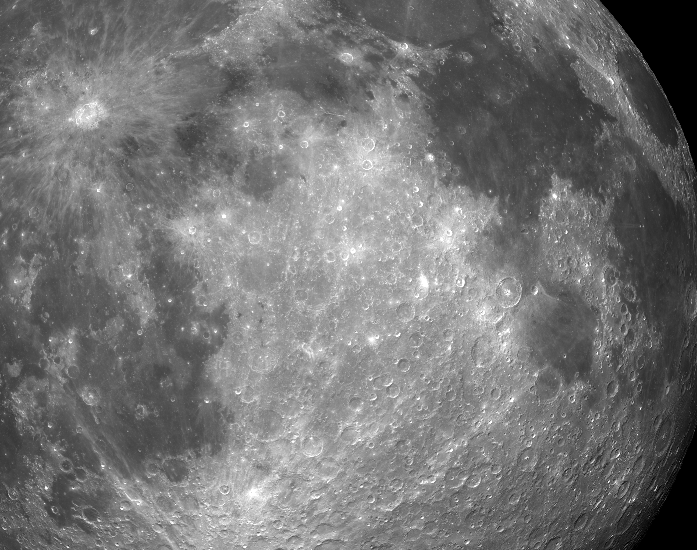
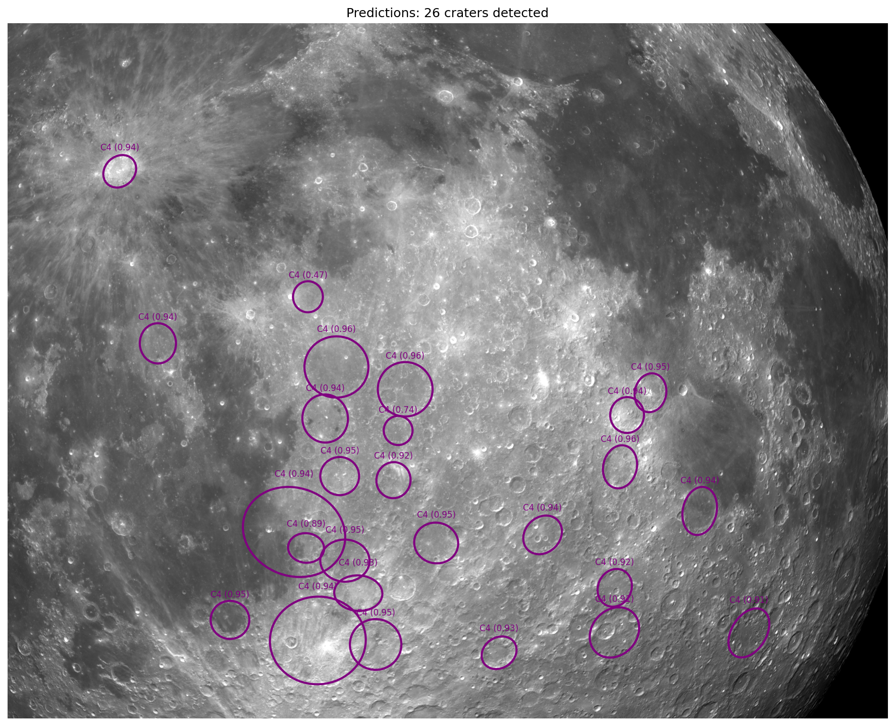
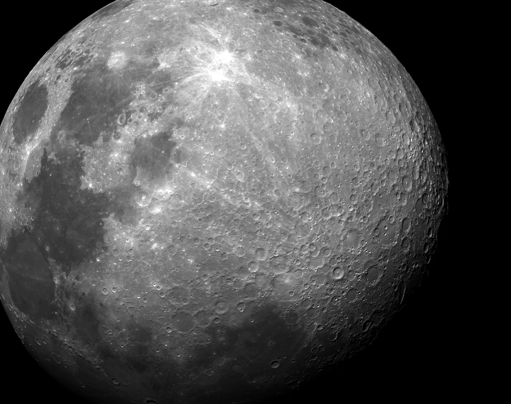
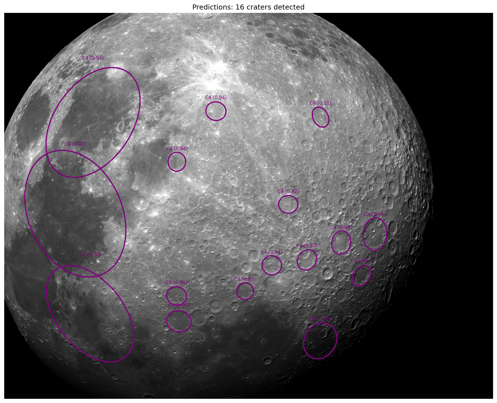
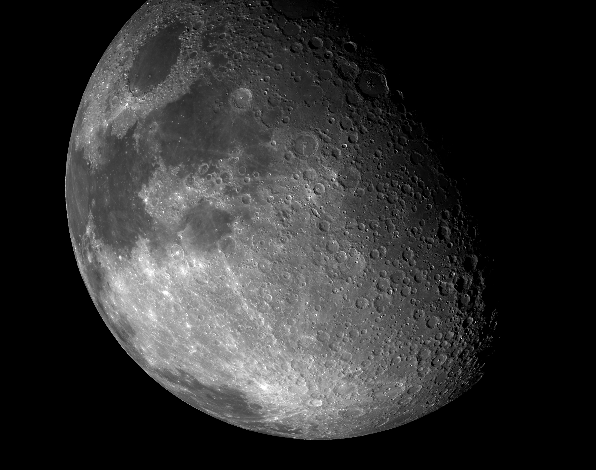
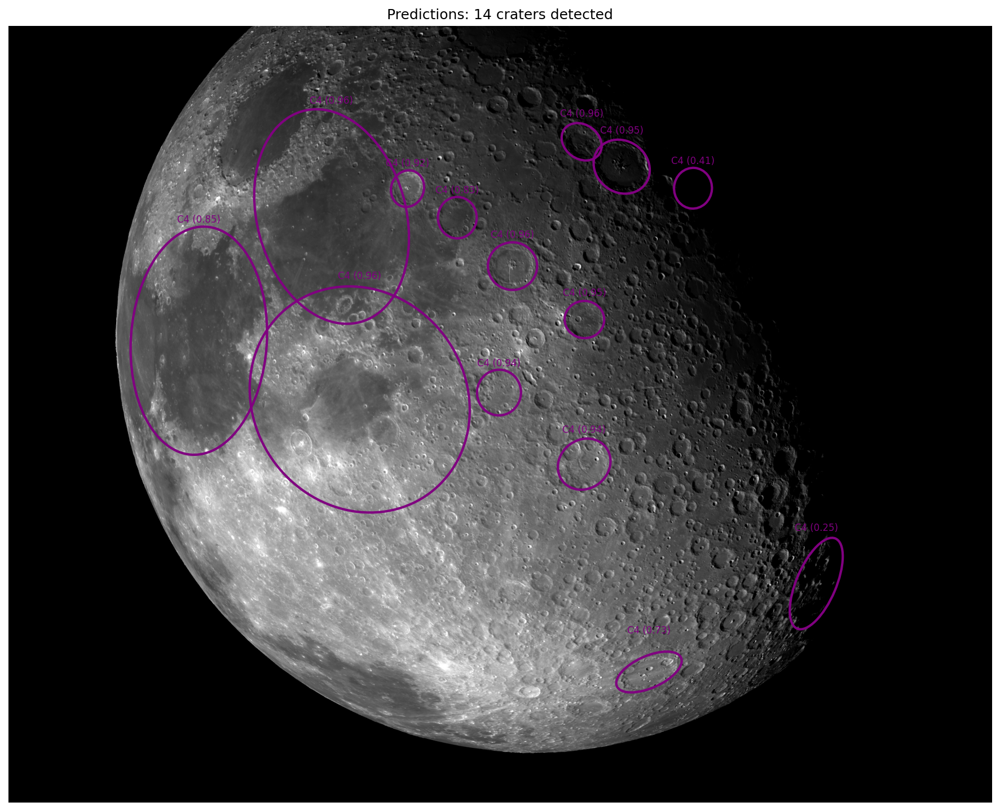
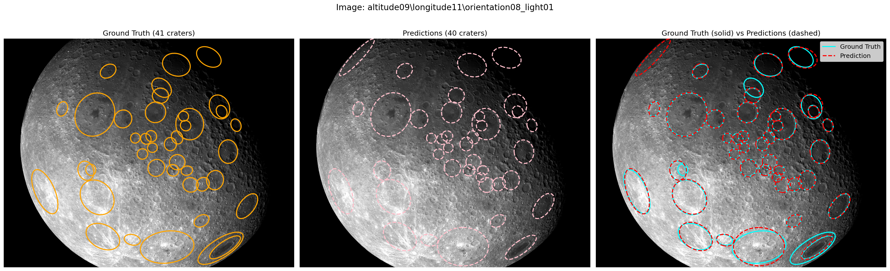

# NASA Crater Detection - YOLO OBB

Crater detection using YOLO11 Oriented Bounding Box model with ellipse parameter prediction. The ellipses are generated using Oriented Bounding Box models pretrained by ultralytics and made open source.

## System Specifications

| Component | Specification |
|-----------|---------------|
| Processor | Intel Core Ultra 9 285H (2.90 GHz) |
| RAM | 32.0 GB (31.5 GB usable) |
| Cores | 16 |
| Logical Processors | 16 |

## Quick Start

### 1. Install Dependencies
```bash
pip install -r requirements.txt
```

### 2. Prepare Dataset
```bash
python yolo_ellipse/train_with_dataloader.py --prepare-only
```

### 3. Train Model (CPU)
```bash
python yolo_ellipse/train_with_dataloader.py --device cpu --batch 16 --workers 16 --epochs 100
```

### 4. Run Inference
```bash
python yolo_ellipse/predict.py --model runs/train/crater_obb/weights/best.pt --source ./test --output predictions.csv
```

## Results

### Sample Predictions

| Original Image | Prediction |
|----------------|------------|
|  |  |
|  |  |
|  |  |

### Ground Truth vs Prediction Comparison



*Left: Ground Truth (cyan) | Middle: Predictions (red) | Right: Overlay comparison*

## Output Format

CSV with columns: `ellipseCenterX(px), ellipseCenterY(px), ellipseSemimajor(px), ellipseSemiminor(px), ellipseRotation(deg), inputImage, crater_classification`

## OBB to Ellipse Conversion

### Parameter Mapping

| OBB Parameter | Ellipse Parameter |
|---------------|-------------------|
| Center (x, y) | `ellipseCenterX`, `ellipseCenterY` |
| Width / 2 | `ellipseSemimajor` |
| Height / 2 | `ellipseSemiminor` |
| Rotation angle | `ellipseRotation` |

### Conversion Formula

```
Ellipse from OBB corners [P0, P1, P2, P3]:

    Center:     cx = mean(x_coords), cy = mean(y_coords)
    Edge1:      P1 - P0
    Edge2:      P3 - P0
    Semimajor:  max(|Edge1|, |Edge2|) / 2
    Semiminor:  min(|Edge1|, |Edge2|) / 2
    Rotation:   atan2(longer_edge.y, longer_edge.x)
```

## Future Scope: Ellipse-Specific IoU Losses

### Current Limitation

The current approach uses OBB IoU loss which treats craters as rectangles. This is suboptimal because:
- Ellipses have ~78.5% area of their bounding rectangle (π/4)
- OBB IoU overestimates overlap in corner regions
- Rotation errors are penalized differently than axis length errors

### References for IoU losses

- [Gaussian Wasserstein Distance for OBB Detection](https://arxiv.org/abs/2101.11952)
- [KLD Loss for Rotated Object Detection](https://arxiv.org/abs/2106.01883)
- [PIoU Loss for Rotated Detection](https://arxiv.org/abs/2007.09584)

## Project Structure

```
├── NASA_dataloader.py                  # Dataset loader with train/val split
├── yolo_ellipse/
│   ├── train_with_dataloader.py        # Training script
│   ├── convert_to_yolo_obb.py          # Tonvert OBBs to ellipse and visa-verse 
│   ├── test_inference.py               # Test document inference script
│   ├── run_pipeline.py                 # Training and dataset creation script
│   ├── predict.py                      # Inference script
│   ├── train.py                        # Train script
│   └── dataset.yaml                    # YOLO config
└── test.ipynb                          # Notebook with inference code
```
